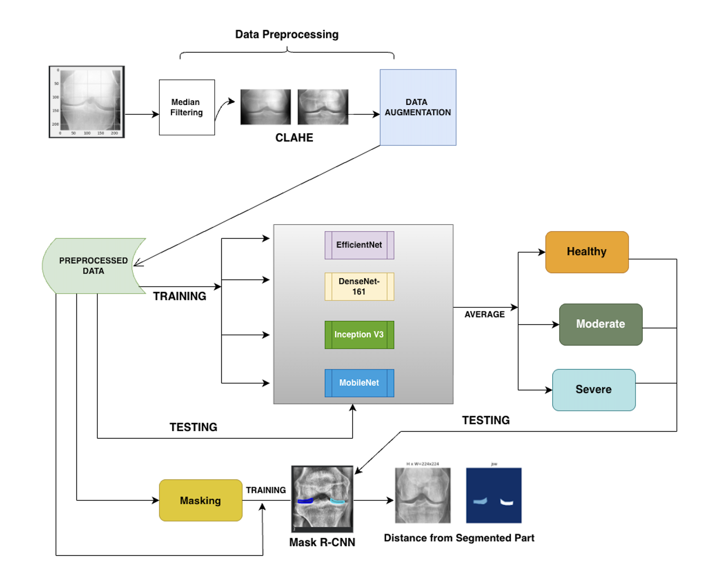

# 🩺 Automated Diagnosis and Quantification of Knee Osteoarthritis

An **end-to-end deep learning system** for automated **Knee Osteoarthritis (KOA) diagnosis** from X-ray images, integrating **ensemble classification, anatomical segmentation, and quantitative Joint Space Width (JSW) measurement**.

This project provides a **clinically reliable and explainable AI-based diagnostic pipeline** aimed at reducing subjectivity in manual radiographic assessment.

---

## 🔍 Problem Statement
Manual grading of Knee Osteoarthritis using X-ray images is **subjective**, time-consuming, and prone to **inter-observer variability**, especially in early and borderline cases.

This project addresses these challenges by:
- Automating KOA severity classification  
- Precisely segmenting the knee joint region  
- Quantifying disease progression using **Joint Space Width (JSW) in millimeters**

---

## 🚀 Key Features
- **Ensemble CNN-based classification** for robust KOA severity prediction  
- **Mask R-CNN segmentation** for accurate knee joint localization  
- **Automated JSW measurement** for objective disease quantification  
- **Clinically aligned severity mapping** (Healthy / Moderate / Severe)  
- High performance with **~99% classification accuracy**

---

## 🧠 Methodology Overview

### 1️⃣ Data Preprocessing
- Median Filtering for noise reduction  
- CLAHE for contrast enhancement  
- Data Augmentation to balance class distribution  

### 2️⃣ KOA Severity Classification
- Transfer Learning using:
  - DenseNet121  
  - EfficientNet  
  - InceptionV3  
  - MobileNetV2  
- Predictions combined using **Ensemble Probability Voting**

### 3️⃣ Knee Joint Segmentation
- Mask R-CNN trained on **expert-annotated ground truth masks**
- Precise extraction of **Region of Interest (ROI)**

### 4️⃣ Joint Space Width (JSW) Measurement
- Pixel-level distance measured from segmented joint region  
- Converted to **millimeters using calibration factor**
- Enables quantitative severity assessment

---

## 📊 Results
- **Ensemble CNN Accuracy:** ~99%  
- **Individual Model Accuracy:** ~94–95%  
- **Mask R-CNN Segmentation IoU:** ~0.73  
- Accurate millimeter-level JSW estimation aligned with clinical standards

---

## 🏗️ Project Architecture

  

The architecture illustrates the complete workflow of the proposed system, including image preprocessing, ensemble-based classification, Mask R-CNN segmentation, and Joint Space Width (JSW) measurement for clinical severity assessment.

---

---

## 🛠️ Tech Stack
- **Programming:** Python  
- **Deep Learning:** TensorFlow / Keras  
- **Segmentation:** Mask R-CNN  
- **Image Processing:** OpenCV, NumPy  
- **Visualization:** Matplotlib  

---

## 🩺 Clinical Relevance
- Enables **objective KOA diagnosis** using JSW measurement  
- Reduces dependency on subjective visual grading  
- Supports early detection and treatment planning  

---

## 🔮 Future Work
- Lightweight model optimization for real-time deployment  
- Multimodal integration with clinical data  
- Expansion to multi-joint osteoarthritis diagnosis  

---

## 📌 Citation
If you use this work, please cite:

> Kartik Joshi, *Automated Diagnosis and Quantification of Knee Osteoarthritis using Deep Learning*, M.Tech Thesis, Thapar University.

---

## 🙌 Author
**Kartik Joshi**  
M.Tech Computer Science & Engineering  
Thapar Institute of Engineering & Technology

